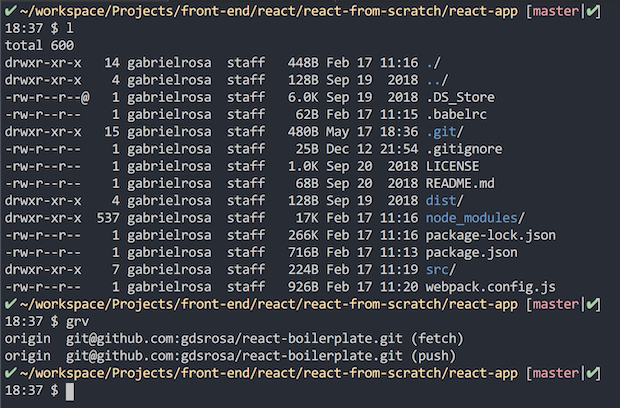
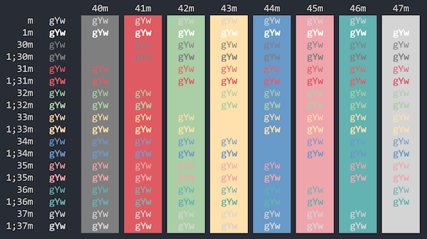

# Subliminal iTerm Color Scheme

A color scheme for [iTerm2](http://iterm2.com/) based on [VS Code Subliminal Minimalistic Theme](https://github.com/gaearon/subliminal) made by [Dan Abramov](https://github.com/gaearon).

## Screenshots




## Install 

### Install using Git

Clone the repository:

```bash
$ git clone https://github.com/gdsrosa/subliminal-itermcolors.git
```

### Install manually

Download the [GitHub .zip](https://github.com/gdsrosa/subliminal-itermcolors/archive/master.zip) and unzip them.

## Activating theme

1. `iTerm2 > Preferences > Profiles > Colors Tab`
2. Click `Load Presets`
3. Click `Import`
4. Select the `your/path/to/Subliminal.itermcolors` file
5. Select the Subliminal from `Load Presets`